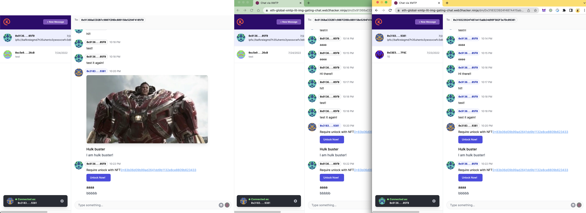
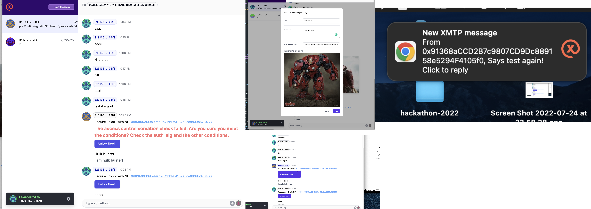

# XMTP+LIT+ChromeExt+ChatOnWeb3WithTokenGatingContent

XMTP web3 chat improvement that with chrome notification, token gating and NFT unlocking widget in chat box ;)

We build a chrome extension that can notify users that they have new messages coming from XMTP.
And we inject into the XMTP Chat Opensource code with LIT and IPFS(via NFT.Storage) that provide users a token gating chat UX.
Users can send images with title/description and NFT gating contract addresses that only users with the NFT in their wallet can `unlock` the image.
This can be used as `chat 2 earn` or `selling while chatting`

## Submission resources List

* [XMTP chat online demo link](https://eth-global-xmtp-lit-img-gating-chat.web3hacker.ninja/)
* [Video Demo Link](https://youtu.be/Isl30gzltsA)
* [Screenshots](./screenshots)
* [XMTP Notification Chrome Extension code](https://github.com/NftTopBest/eth-global-XMTP-LIT-img-gating-chat/blob/main/xmtp-notification-chrome-extension/README.md)
* [XMTP Chat PR code](https://github.com/NftTopBest/xmtp-chat-with-lit/pull/1/files)

## Tech We used

* XMTP Notification Chrome Extension
  * [Chrome extension dev MV3](https://developer.chrome.com/docs/extensions/mv3/intro/)
    * [chrome.storage](https://developer.chrome.com/docs/extensions/reference/storage/) store xmtp keys
    * [chrome.notifications](https://developer.chrome.com/docs/extensions/reference/notifications/) create notifications while receive new message from xmtp
  * [XMTP](https://github.com/xmtp/xmtp-js) the lib to start the XMTP new message listener
    * [Listen for new messages in a conversation](https://github.com/xmtp/xmtp-js#listen-for-new-messages-in-a-conversation)
    * [List existing conversations](https://github.com/xmtp/xmtp-js#list-existing-conversations)
* Web3 LIT token gating Chat: `chat 2 earn` or `selling while chatting`
  * [LIT](https://litprotocol.com/)
  * [XMTP](https://xmtp.com/)
    * [XMTP chat example open source code](https://github.com/xmtp/example-chat-react)
  * [IPFS: NFT.Storage SDK](https://nft.storage/docs/)
  * [TailwindCSS](https://tailwindcss.com/)
  * [HeadLess UI](https://headlessui.com/react/dialog)
  * [Polygon Testnet Mumbai to deploy our ERC721 NFT contract](https://mumbai.polygonscan.com/)

## Features && Sponsor Technology Explain

* User can receive new XMTP message notification via our Chrome Notification Extension
  * user can login with metamask: [code](https://github.com/NftTopBest/chrome-extension-xmtp-notifictation/blob/main/src/context/WalletProvider.js#L144)
  * user can login into xmtp to get the xmtp keys: [code](https://github.com/NftTopBest/chrome-extension-xmtp-notifictation/blob/main/src/context/WalletProvider.js#L109)
  * user can receive notification while get new xmtp message: [code](https://github.com/NftTopBest/chrome-extension-xmtp-notifictation/blob/main/src/context/WalletProvider.js#L83)
* [IPFS & Filecoin](https://ethglobal.com/events/hackfs2022/prizes#ipfs-and-filecoin) NFT.Storage
  * we build the `useNFTStorage` hook to provide a utils for our application to interact with IPFS: [code](https://github.com/NftTopBest/xmtp-chat-with-lit/pull/1/files#diff-2a09e7c28157db59a45459d3ec9ecaa190ce2477b0f9cc5cba44e42510ee4381)
  * upload encryptedFile to IPFS: [code](https://github.com/NftTopBest/xmtp-chat-with-lit/pull/1/files#diff-d5c6ae9b3e48335a201524ea02f620402ef77d124d2686e298cae142d3fba74bR41-R59)
  * upload encryptedFile metadata json  to IPFS: [code](https://github.com/NftTopBest/xmtp-chat-with-lit/pull/1/files#diff-d5c6ae9b3e48335a201524ea02f620402ef77d124d2686e298cae142d3fba74bR67-R86)
  * get json data from IPFS by the `getJson` function write in `useNFTStorage` hook: [code](https://github.com/NftTopBest/xmtp-chat-with-lit/pull/1/files#diff-efef3152bda1b784ec4b6c330dcc8a320b4d95d2c94abdfc125c973b4eeba510R63-R71)
  * fetch the encryptedFile via nftstorage.link url: [code](https://github.com/NftTopBest/xmtp-chat-with-lit/pull/1/files#diff-efef3152bda1b784ec4b6c330dcc8a320b4d95d2c94abdfc125c973b4eeba510R29-R39)
* [Polygon](https://ethglobal.com/events/hackfs2022/prizes#polygon)
  * We deploy an ERC721 NFT contact to mumbai testnet to test our token gating contract [polygonscan link](https://mumbai.polygonscan.com/address/0x83b06d09b99ad2641dd9b1132e8ce8809b623433#code)
  * It's an ERC721 contract with ERC2981 interface implement: [code](https://github.com/NftTopBest/eth-global-XMTP-LIT-img-gating-chat/blob/main/contracts/CTC_ERC721A2.sol#L9)
  * It can admin with some params: [code](https://github.com/NftTopBest/eth-global-XMTP-LIT-img-gating-chat/blob/main/contracts/CTC_ERC721A2.sol#L89-L118)
    * Provide white list addresses with mint number specific
    * toggle reveal/opened/publicMint status
    * setup public mint price
    * setup royalty value
    * mint with white list or public mint: [code](https://github.com/NftTopBest/eth-global-XMTP-LIT-img-gating-chat/blob/main/contracts/CTC_ERC721A2.sol#L135-L185)
* [XMTP](https://ethglobal.com/events/hackfs2022/prizes#xmtp) && [LIT](https://ethglobal.com/events/hackfs2022/prizes#lit-protocol)
  * User can send token gating content in chat box
    * Inject ipfs file upload logic and combine it with LIT token gating: [TokenGatingModal code](https://github.com/NftTopBest/xmtp-chat-with-lit/pull/1/files#diff-d5c6ae9b3e48335a201524ea02f620402ef77d124d2686e298cae142d3fba74b)
    * Input ERC721 contract address
    * select image and gating with LIT
      * show preview before submit(without gating)
        * encrypt with LIT
    * generate metadata CID
    * submit metadata CID as message content
  * User can unlock token gating content in message list
  * Chat message content with the NFT gating UX [MessageContent code](https://github.com/NftTopBest/xmtp-chat-with-lit/pull/1/files#diff-efef3152bda1b784ec4b6c330dcc8a320b4d95d2c94abdfc125c973b4eeba510)
  * unlock button to wait for user to unlock the chat message
  * [LitProvider](https://github.com/NftTopBest/xmtp-chat-with-lit/pull/1/files#diff-3a14c746ec8e9e2076e63cc868894aca171a2adc52dc7e08a5884b872d1d1dc5) to provide LIT init and helper function

## Future Plan

* Rewrite our own Chat Application with XMTP and LIT by Vue3 framework
* Chrome Extension will inject ui into Twitter page that can chat direct on the twitter page also show some of the user's NFT on that injected components.
* Build the next generation of the Social platform that all follow the Web3 logic!
* make the XMTP listener work in the background service worker
  * I have spend over 10+ hours try to make it work in the background service worker, but it has some issues
    * xmtp package has some kind of `fs` call that can not work in browser
    * that I can not compile it to work in the background.js
* use [plasmo extension framework](https://www.plasmo.com/) to re-build the extension
  * I try before over 20 hours, but still, the same as the xmtp compile problem
  * Need more digging for this problem

